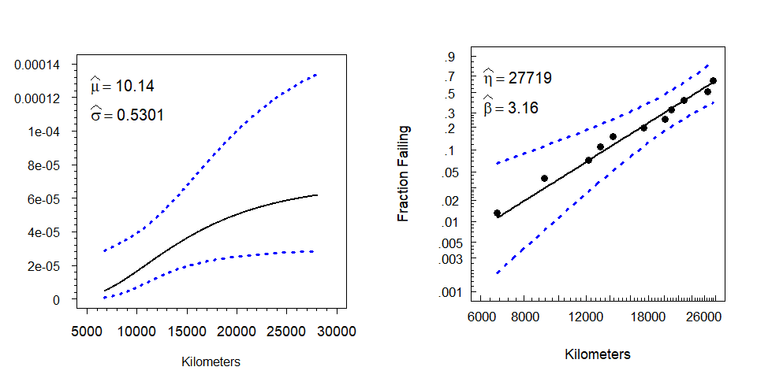

:package: SMRD: Statistical Methods for Reliability Data
================
Jason K. Freels, William Q. Meeker, and Luis A. Escobar
<br/>06 June 2019

[](https://www.tidyverse.org/lifecycle/#experimental)
[](https://cran.r-project.org/package=SMRD2)
[](https://travis-ci.org/Auburngrads/SMRD2)

<details>
  
<summary style="font-size: 29pt; font-weight: bold;">Overview</summary>

  - ***Statistical Methods for Reliability Data*** (Meeker & Escobar) is
    a foundational text for analyzing failure-time and survival data

  - Along with the text, the authors developed an S-Plus software
    package to utilize the methods for industry data

  - Today, R is the most popular statistical computing language in the
    world - largely supplanting S

  - This presentation introduces tools under-development for use with
    the current and future versions of the ***SMRD*** to
    
      - Analyzing industry and, laboratory test data
      - Simplify reliability/survivability instruction in the classroom

</details>

## The ***SMRD*** Toolkit

1.  R Package `SMRD`
    
      - Implements methods from the text to reproduce results from the
        text
      - Implements methods from the text for use on industry data
      - Interactive Shiny gadgets to instantly perform reliability
        analyses and generate reports

2.  ***Statistical Methods for Reliability Data in R***
    
      - Expanded package documentation and example vignettes
      - In-depth examples corresponding to each chapter in the
        ***SMRD*** text

3.  R package `teachingSMRD`
    
      - Examples from the ***SMRD*** reproduced as interactive shiny
        apps
      - Automatic generation of assigments and solutions for ***SMRD***
        exercises
        
</details>
# Background | The R Languange & R Packages

## The R Project for Statistical Computing

  - A statistical programming environment for data analysis and graphics

  - Developed by Ross Ihaka and Robert Gentleman at the University of
    Auckland

  - Open-source implementation of the ‘S’ language created by Becker et.
    al. at Bell Labs

  - A pre-eminent tool for statistics and data science

  - One of the fastest growing technical computing languages in the
    world
    
      - Used for data processing and visualization, computational
        statistics, and natural language processing etc.
    
      - Heavily used by Google, Facebook, Twitter, Microsoft, etc.

## R Packages

  - In R, the fundamental unit of shareable code is called a package

  - Packages bundle together code, data, documentation, and tests to
    easily share analysis methods with others

  - Currently 14278 packages are available on the Comprehensive R
    Archive Network ([CRAN](https://cran.r-project.org))

  - Many more available from the
    [Bioconductor](https://www.bioconductor.org) and
    [GitHub](https://github.com) repositories

  - The huge variety of packages is a key reason why R is so popular
    
      - Chances are that someone has already solved a problem that
        you’re working on
    
      - You can benefit from their work by downloading their package

# R Package `SMRD` | Development Process and Package Features

## `SMRD` - Development Process

  - Meeker developed a large collection of FORTRAN subroutines as part
    of contracted efforts

  - Meeker & Escobar wrapped the FORTRAN code into an S-Plus package
    called [*SPLIDA*](http://www.public.iastate.edu/~splida/')
    (**S**-**P**lus **LI**fe **D**ata **A**nalysis)

  - *SPLIDA* serves as the companion software for
    <a target=' 'href='https://www.amazon.com/Statistical-Methods-Reliability-William-Meeker/dp/0471143286'>Statistical
    Methods for Reliability Data</a> 1st ed.

  - Meeker began an effort to translate *SPLIDA* into R under the name
    *RSplida*
    
      - Not user-friendly - couldn’t be installed as a traditional R
        package
    
      - Difficult to use with modern IDE’s (i.e. RStudio, Visual Studio,
        Eclipse, etc.)

## `SMRD` - Development Process (cont.)

  - (**2015**) Freels & Meeker sign MOU to share FORTRAN code for
    purpose of developing an R package

  - Aim to publish `SMRD` to the CRAN in 2018

  - Remaining tasks to be completed before publishing <b>(%
    complete)</b>
    
      - (90%) Update older R & S-Plus idioms to modern equivalents
      - (75%) Update graphics objects
      - (75%) Document datasets
      - (75%) Update for modern use-cases - literate
        programming/interactivity
      - (50%) Ensure compatibility with modern dependencies
      - (15%) Document exported functions
      - (10%) Translate FORTRAN code over C++

## `SMRD` Package Features | Estimation/prediction methods for many types of failure data

  - Multiple failure events
  - Censored data (right, left, and interval censoring)
  - Truncated data (right, left, and interval truncation)
  - Failure data with explanatory variables (failure-time regression)
  - Repeated measures degradation data (linear & non-linear mixed
    effects)
  - Repairable system failure data (recurring events)
  - Physical/performance degradation data
  - Failure data with prior information (Bayesian reliability)
  - Reliability growth test data
  - Reliability test simulations

## `SMRD` Package Features | Minimal data pre-processing through flexible event definitions

<ul>

<li>

Organizations often use different terms to describe the same event

</li>

<ul>

<li>

‘Failure’ = ‘Failed’ = ‘Fail’ = ‘dead’ = ‘died’

</li>

<li>

‘right’ = ‘rcensored’ = ‘suspended’ = ‘alive’

</li>

<li>

‘left’ = ‘doa’ = ‘lcensored’

</li>

<li>

‘interval’ = ‘int’ = ‘icensored’ = ‘grouped’

</li>

</ul>

<li>

Many applications force users to recode these events

</li>

<li>

`SMRD` allows for flexible event definitions to utilize the data as-is

</li>

<li>

<focus>Event definitions can even be mixed</focus>

</li>

<li>

`SMRD` event definitions easily mapped to `survival` numeric definitions

</li>

</ul>

## `SMRD` Default Event Definitions

## `SMRD` Package Features | Easily Access Data from Multiple Sources

  - `SMRD` includes over 120 fully-documented datasets

  - For importing external data, `SMRD` leverages several other R
    packages

  - Excel files
    
      - `XLConnect`, `readxl`, `xlsx`

  - CSV/TSV files
    
      - `base`, `utils`, `readr`, `data.table`

  - Info, Minitab, S, SAS, SPSS, Stata, Systat and Weka files
    
      - `foreign`, `HMISC`

## `SMRD` Package Features | Faster workflows through literate programming

**Literate programming:** integrating text with snippets of executable
code in documents & presentations

  - In R, literate programming is supported by the `knitr` and
    `rmarkdown` packages
    
      - Weave code from multiple languages, \(\LaTeX\)-typeset
        equations, and text together in one document
      - Run and compile `code`, <green>\(\LaTeX\)</green>,
        <focus>text</focus> simultaneously
      - Everything is stored in a single file
      - Output to any of a number of presentation or document formats

## `SMRD` Package Features | Faster workflows through literate programming

  - With *SPLIDA*, many results were returned simultaneously
    
      - Graphics
      - Numeric values
      - Tables of results
      - Text summaries

  - For GUI-based software tools, presenting multiple results is
    <green>GOOD</green>

  - For tools emphasizing reproducible research and literate
    programming, presenting multiple results simultaneously is
    <red>BAD</red>
    
      - `SMRD` built to support literate programming - go from data to
        report fast
      - Ensure that specific results can be produced and called where
        desired

# A Quick `SMRD` Example | Analyzing the shockabsorber dataset

## Dataset: `shockabsorber`

  - This example demonstrates some of the `SMRD` functions to analyze
    the shockabsorber dataset used throughout the text

<!-- end list -->

``` r
shockabsorber
```

``` 
   miles     mode    event
1   6700    Mode1  Failure
2   6950 Censored Censored
3   7820 Censored Censored
4   8790 Censored Censored
5   9120    Mode2  Failure
6   9660 Censored Censored
7   9820 Censored Censored
8  11310 Censored Censored
9  11690 Censored Censored
10 11850 Censored Censored
11 11880 Censored Censored
12 12140 Censored Censored
13 12200    Mode1  Failure
14 12870 Censored Censored
15 13150    Mode2  Failure
16 13330 Censored Censored
17 13470 Censored Censored
18 14040 Censored Censored
19 14300    Mode1  Failure
20 17520    Mode1  Failure
21 17540 Censored Censored
22 17890 Censored Censored
23 18450 Censored Censored
24 18960 Censored Censored
25 18980 Censored Censored
26 19410 Censored Censored
27 20100    Mode2  Failure
28 20100 Censored Censored
29 20150 Censored Censored
30 20320 Censored Censored
31 20900    Mode2  Failure
32 22700    Mode1  Failure
33 23490 Censored Censored
34 26510    Mode1  Failure
35 27410 Censored Censored
36 27490    Mode1  Failure
37 27890 Censored Censored
38 28100 Censored Censored
```

## Creating `life.data` Objects

  - Many of the methods in the package require a `life.data`-class
    object

<!-- end list -->

``` r
shock.ld <- frame.to.ld(frame = shockabsorber,
                        response.column = 1,
                        failure.mode.column = 2,
                        censor.column = 3,
                        time.units = 'Kilometers')
```

  - Since *SPLIDA* was written as a GUI, many functions to produce
    results and graphics already existed

  - Thus, once the `life.data` object has been created, many different
    plots and numeric results can be produced, each requiring only a
    single line of code

## Producing Results From `life.data` Objects

<div class="columns-2">

  - Nonparametric CDF plots

  - Parametric CDF plots

  - ML CDF and hazard plots

  - Explanatory variable plots

  - Multi-failure mode plots

  - Relative likelihood surfaces

  - Relative likelihood curves

<br/>

  - \(F(t)\) at specified values of \(t\)

  - \(h(t)\) at specified values of \(t\)

  - \(t^{-1}(p)\) at specified values of \(p\)

  - ML parameter estimates and standard errors

  - Logit and log transformed confidence intervals (pointwise and
    simultaneous)

</div>

## Nonparametric & Parametric CDF plots

``` r
plot(shock.ld)
plot(shock.ld, distribution = 'lognormal')
```


## ML Plots \(F(t)\) & \(h(t)\)

``` r
mlehazplot(shock.ld,  distribution = 'lognormal', param.loc = 'topleft')
mleprobplot(shock.ld, distribution = 'weibull', param.loc = 'topleft')
```



## ML Surface Plots

``` r
simple.contour(shock.ld, distribution = 'sev', threeD = T, original.par = F)
simple.contour(shock.ld, distribution = 'sev', show.confidence = F, zoom = 1.75)
```


## ML Estimate Table | Generate tables automatically

``` r
(tab <- print(mlest(shock.ld, distribution = 'weibull'))$mle)
```

    ##                       MLE   Std.Err.  95% Lower  95% Upper
    ## mu             1.0230e+01 1.0989e-01    10.0145 1.0445e+01
    ## sigma          3.1641e-01 7.3165e-02     0.2011 4.9783e-01
    ## Weibull (eta)  2.7719e+04 3.0460e+03 22347.7684 3.4380e+04
    ## Weibull (beta) 3.1605e+00 7.3082e-01     2.0087 4.9726e+00
